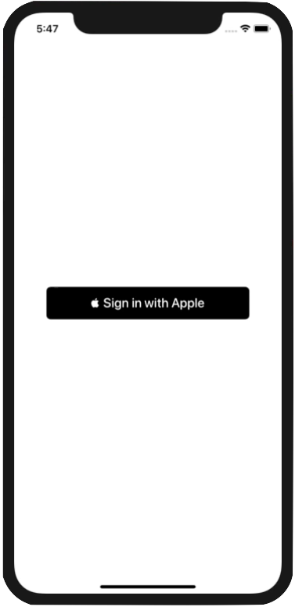
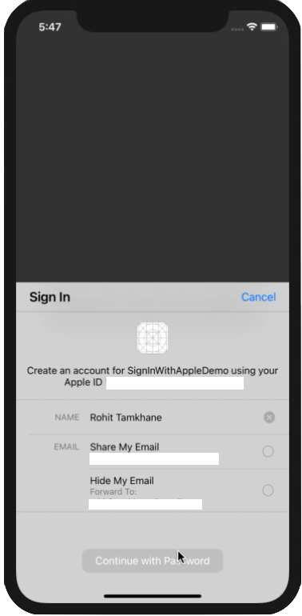

# SignInWithApple

## Description

"Sign In with Apple" is a new way for users to create accounts and sign in into iOS apps. Follow the tutorial to learn how to implement the Sign in with Apple button in Swift. [Medium.com](https://medium.com/@rohittamkhane/implement-sign-in-with-apple-button-in-swift-71f6c76fce2c)

## Screenshots

